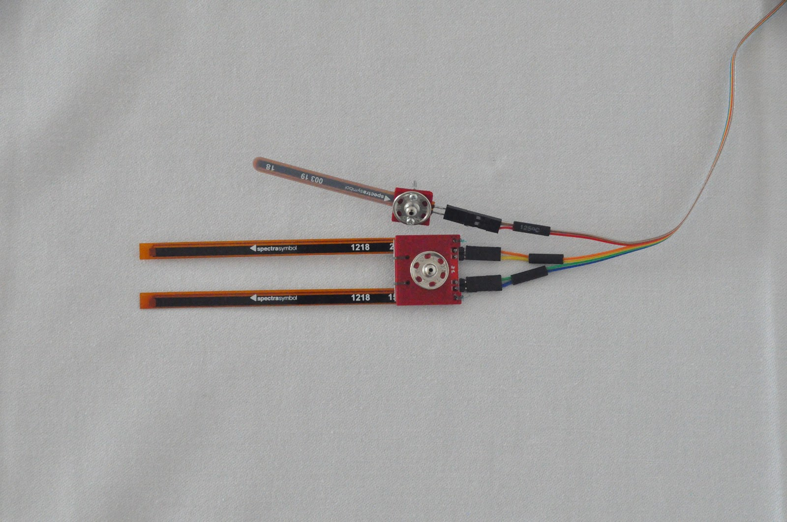

# SpiderHand: Supporting Arachnophobia Therapy UsingMotion-controlled Robotic Manipulator
Submitted to EAI Mobiquitous 2020

When attempting to set up the system for the first time, please consult short videos in Previews folder. It might be useful to understand the assembly details.

## Component list:
Below, we list all components necessary to successfully replicate SpiderHand manipulator. We encourage to introduce your own innovations and alter our design, yet at own risk.

**Microcontrollers and drivers**

- Adafruit Feather Huzzah ESP32   1 pcs.
- Adafruit Feather Huzzah ESP8266 5 pcs.
- ADS1015 12-Bit ADC - 4 Channel with Programmable Gain Amplifier 1 pcs.
- Adafruit 16-Channel 12-bit PWM/Servo Driver - I2C interface - PCA9685   2 pcs.

**Sensors, Servos, Devices**

- Flex Sensor 4.5"    1 pcs.
- Flex Sensor 2.2"    1 pcs.
- SparkFun Qwiic Flex Glove Controller    1 pcs.
- BendLabs 2-Axis Soft Flex Sensor    1 pcs.
- DFRobot 6 DOF Sensor - MPU6050  1 pcs.
- PowerHD HD-1501MG   3 pcs.
- PowerHD LF-20MG 1 pcs.
- Hitec HS-45HB   3 pcs.
- Shaftless Vibration Motor 10x3.4mm  5 pcs.

**Assembly Screws and Accessories**

- M2 nut  8 pcs.
- M2x8mm  11 pcs.
- M2x3mm  5 pcs.
- M3 nut  22 pcs.
- M3x6mm  8 pcs.
- M3x10mm 25 pcs.
- M3x18mm 4 pcs.
- M4 nut  2 pcs.
- M4x30mm 2 pcs.
- Aluminium horn - 20mm / 6mm 4 pcs.
- Servo extension 90cm    7 pcs.
- FeatherWing Proto - Prototyping Add-on  1 pcs.
- 10-wire Ribbon cable    5 m

**Fabric Accessories**

- Sport gloves    2 pcs.
- Elbow protector 1 pcs.
- Polyester tape (width: 2cm) 2m
- Buckles compatible with the 2cm tape    2 pcs.
- Latches 5mm 6 pcs.
- Latches 15mm    6 pcs.

## 3D printing remarks:

**Filaments used:**

1. Fiberlogy Easy PLA
2. Zortrax Z-ABS
3. Proto-paste Electrically Conductive Composite PLA
4. Fiberlogy Fiberflex 40D

**Printers used:**

1. Creality3D Ender-3
2. Zortrax M200

**Slicer:** Ultimaker Cura 4.5

Finger elements (Finger i Touch) and joints (Flex) should be reduced to 80% before printing because the elements come from the following project [https://www.thingiverse.com/thing:242639](https://www.thingiverse.com/thing:242639).

The elements from part_1 to part_10 and all the elements starting with “Finger” can be printed at your discretion using ABS or PLA. The important thing during printing is to set the lowest fill factor (in our case it is 12%) in order to relieve the construction.

The elements called “Flex” should be printed from the elastic material according to the manufacturer’s recommendations. It is suggested to use ironing on the last layer to obtain a consistent element.

The finger pads called “Touch” should be printed from the conductive material.

Before assembling according to the model, the following be embedded by heat-set insert (soldering nuts): M4: 1,2; M3: 8, 9, 24, 25, 26; M2: 1, 2, 3, 4, 5, 6, 7, 8, 12, 13

## Software remarks:

Source codes and drivers for the prototype are compatible with the Arduino IDE 1.8.12

It is necessary to install boards drivers:

1. esp32 by Espressif Systems version 1.0.2 [https://dl.espressif.com/dl/package_esp32_index.json](https://dl.espressif.com/dl/package_esp32_index.json)
2. esp8266 by ESP8266 Community version 2.1.0 [http://arduino.esp8266.com/stable/package_esp8266com_index.json](http://arduino.esp8266.com/stable/package_esp8266com_index.json)

<ins>Sensor and communication libraries used:</ins>

1. SparkFun_ADS1015_Arduino_Library
2. Adafruit_PWM_Servo_Driver_Library
3. ads_two_axis_driver
4. MPU6050
5. Adafruit_ADS1X15

**Sensor Calibration Sheet**

Auxiliary material contains a spreadsheet useful for calibrating the setup. Coefficient values for flex sensor calibration can be obtained using the Calibration.xlsx file. Please consult it for instruction on how to provide correct coefficient values to the MotorFingersElbow.ino source file.

**PCB Design**

The PCB boards were designed in EAGLE software (version 9.2.2).

## Controller assembly remarks:

Electronic components have to be sewn to the material elements.
The belt (thickness: 2cm) should be adjusted and ended with the buckles. In the middle part one shall sew one latch for each part. The other end will be attached to the sensors.

On the elbow protector 2 pairs of the 15mm latches should be attached, which will properly keep the loop and the beginning of the sensor.

Six small latches should be sewn to the glove - 5 to each vibration motor and 1 to the end of the 2-axis sensor. The remaining two bigger latches are to attach bend sensors on the fingers. In order to make the reading possible a second glove should be worn. The second option is to cut only the fingers.

  
  

  
  

  
  
  
  
  
  

Hope you’re enjoying SpiderHand!
